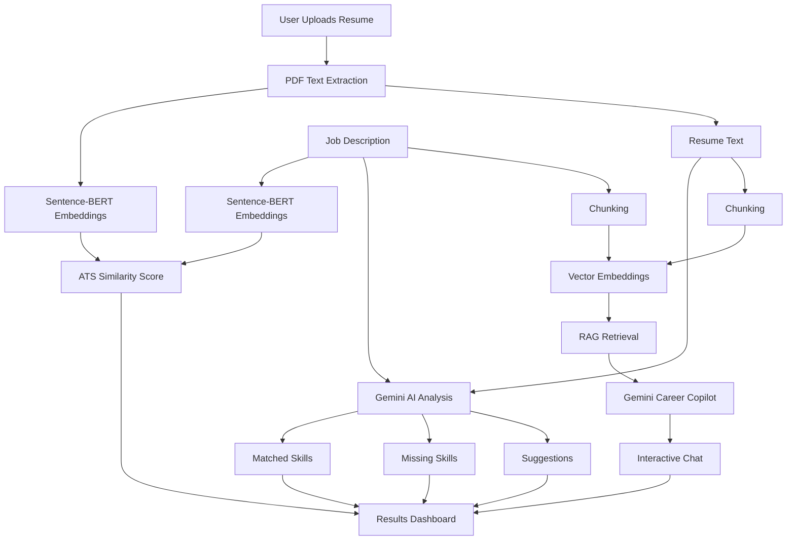

# ResumeIQ

### AI-Powered Resume Analyzer with Semantic Matching, RAG Chat, and Gemini Career Feedback

Crafting a strong resume isn't just about matching keywords—it's about demonstrating the right skills and experiences in a way that aligns with the target role. Traditional ATS systems often rely heavily on keyword matching, making it difficult for applicants to understand why their resumes succeed or fail.

**ResumeIQ** is an AI-powered resume analysis platform that combines semantic similarity, Retrieval-Augmented Generation (RAG), and Google's Gemini models to evaluate how well a resume aligns with a job description.

Instead of only providing an ATS score, ResumeIQ explains the reasoning behind the evaluation, identifies skill gaps, highlights matched competencies, and allows users to interact with the analysis through an AI-powered career assistant grounded in the uploaded resume and job description.

---

# Why ResumeIQ?

Most resume analyzers provide only a similarity score or generic AI suggestions. ResumeIQ goes further by combining semantic understanding with Retrieval-Augmented Generation (RAG) to deliver personalized, context-aware career guidance.

### Traditional Resume Checkers

- Keyword matching only
- Generic suggestions
- No contextual understanding
- Limited interaction after analysis
- Black-box AI feedback

### ResumeIQ

- Semantic similarity using Sentence-BERT
- ATS compatibility scoring
- AI-generated skill gap analysis
- Context-aware RAG career assistant
- Interactive follow-up questions grounded in uploaded documents

---

# Features

## 📄 Intelligent Resume Analysis

- Upload resume PDFs for automated analysis
- Semantic similarity scoring using Sentence-BERT (MPNet)
- ATS compatibility evaluation
- Resume–Job Description matching
- AI-generated career recommendations

## 🧠 AI-Powered Career Insights

- Gemini-powered resume evaluation
- Skill gap identification
- Matched skills detection
- Partial skill matching
- Personalized improvement suggestions

## 🔍 Retrieval-Augmented Generation (RAG)

- Resume and Job Description chunking
- Semantic retrieval using vector embeddings
- Context-aware AI responses
- Grounded career guidance based on uploaded documents
- Interactive RAG-powered career assistant

## 💬 Interactive Resume Chat

- Ask follow-up questions about the analysis
- AI explains ATS score and recommendations
- Suggested questions for faster interaction
- Multi-turn conversational experience

## ⚡ User Experience

- Modern responsive Flask interface
- Drag-and-drop resume upload
- Interactive ATS score visualization
- Skill match dashboard
- Exportable analysis report

---

# 🏗️ System Architecture



## Architecture Overview

ResumeIQ combines semantic similarity, Generative AI, and Retrieval-Augmented Generation (RAG) to provide intelligent resume analysis.

After a resume is uploaded, text is extracted and compared with the job description using Sentence-BERT embeddings to calculate an ATS compatibility score. Gemini then performs structured skill-gap analysis, identifying matched skills, missing competencies, and personalized recommendations.

To support interactive follow-up questions, both the resume and job description are chunked, embedded, and indexed for Retrieval-Augmented Generation. When a user asks a question, only the most relevant document passages are retrieved and supplied to Gemini, enabling grounded, context-aware career guidance instead of generic AI responses.

---

# 🔄 Project Workflow

```mermaid
flowchart LR

A[Upload Resume PDF] --> B[Extract Resume Text]

B --> C[Generate Sentence-BERT Embeddings]

C --> D[Calculate ATS Similarity Score]

D --> E[Gemini Skill Gap Analysis]

E --> F[Chunk Resume & Job Description]

F --> G[Generate Vector Embeddings]

G --> H[RAG Retrieval]

H --> I[Interactive Career Copilot]

I --> J[Display Dashboard & AI Feedback]
```



## Workflow Explanation

### 1. Resume Upload
The user uploads a PDF resume and pastes the target job description.

### 2. Text Extraction
Resume text is extracted using PDFMiner while preserving readable content for downstream analysis.

### 3. Semantic Similarity
Sentence-BERT (MPNet) generates embeddings for both the resume and job description. Cosine similarity is used to estimate ATS compatibility.

### 4. AI Analysis
Gemini analyzes both documents to identify matched skills, missing skills, partial matches, and personalized recommendations.

### 5. RAG Indexing
The resume and job description are split into semantic chunks, embedded, and prepared for Retrieval-Augmented Generation.

### 6. Interactive Career Copilot
User questions are answered using only the most relevant retrieved chunks, producing grounded career guidance instead of generic AI responses.

### 7. Results Dashboard
The application presents ATS score, skill gap analysis, AI feedback, and an interactive chat interface for further exploration.

---

# 🛠️ Technology Stack

| Category | Technology |
|------------|------------|
| Programming Language | Python |
| Backend Framework | Flask |
| Frontend | HTML, CSS, JavaScript |
| AI Model | Google Gemini 2.5 Flash |
| Semantic Similarity | Sentence-BERT (all-mpnet-base-v2) |
| Vector Retrieval | Sentence-BERT Embeddings |
| PDF Processing | PDFMiner |
| Machine Learning | Scikit-learn |
| Environment Variables | python-dotenv |
| AI SDK | google-generativeai |

---

# 📂 Folder Structure

```text
ResumeIQ/
│
├── app.py
├── config.py
├── requirements.txt
├── README.md
├── .gitignore
├── .env.example
├── LICENSE
│
├── routes/
│   └── main_routes.py
│
├── services/
│   ├── case_store.py
│   ├── gemini_service.py
│   ├── pdf_service.py
│   ├── rag_service.py
│   └── similarity_service.py
│
├── static/
│   ├── css/
│   │   └── style.css
│   └── js/
│       └── chat.js
│
├── templates/
│   ├── base.html
│   ├── index.html
│   └── results.html
│
└── screenshots/
```

### Folder Description

| File / Folder | Description |
|---------------|-------------|
| `app.py` | Flask application entry point and application factory. |
| `config.py` | Environment configuration and application settings. |
| `routes/` | Flask routes and request handling. |
| `services/` | AI analysis, PDF processing, RAG, similarity, and business logic. |
| `templates/` | HTML templates rendered by Flask. |
| `static/` | CSS and JavaScript assets. |
| `requirements.txt` | Python dependencies. |
| `.env.example` | Environment variable template. |

---

# ⚙️ Installation

## 1. Clone the Repository

```bash
git clone https://github.com/CheshtaSharma/ResumeIQ.git

cd ResumeIQ
```

---

## 2. Create a Virtual Environment

### Windows

```bash
python -m venv venv

venv\Scripts\activate
```

### Linux / macOS

```bash
python3 -m venv venv

source venv/bin/activate
```

---

## 3. Install Dependencies

```bash
pip install -r requirements.txt
```

---

## 4. Configure Environment Variables

Create a `.env` file.

```env
GEMINI_API_KEY=
FLASK_SECRET_KEY=
```

---

## 5. Run the Application

```bash
python app.py
```

Open your browser and visit

```text
http://localhost:5000
```

---

# 📸 Screenshots

## 🏠 Home Page

Modern landing page with drag-and-drop resume upload and job description input.


---

## 📄 Resume Upload

Upload your resume PDF and prepare it for AI analysis.


---

## 📊 Analysis Dashboard

ATS score, semantic similarity, and AI-generated insights.


---

## 🎯 Skill Gap Analysis

Matched skills, missing skills, and personalized recommendations.


---

## 💬 AI Career Copilot

Ask follow-up questions using the Retrieval-Augmented Generation (RAG) assistant.


---

# 📊 Project Highlights

- 📄 PDF Resume Analysis
- 🎯 ATS Compatibility Scoring
- 🧠 Sentence-BERT Semantic Similarity
- 🤖 Gemini-powered Career Feedback
- 🔍 Skill Gap Detection
- 💬 Retrieval-Augmented Generation (RAG) Career Copilot
- 📊 Interactive AI Dashboard
- 📤 Exportable Analysis Report
- ⚡ Modern Flask Web Application

---

# 📈 Future Improvements

- Support DOCX resumes
- Resume section rewriting
- Cover letter generation
- Resume version comparison
- Multi-job comparison
- Authentication and user accounts
- Cloud deployment
- Resume history dashboard
- Export reports as PDF
- Recruiter mode for candidate evaluation

---

# 🎯 Lessons Learned

Developing ResumeIQ provided practical experience in combining semantic similarity, Generative AI, and Retrieval-Augmented Generation (RAG) to build an intelligent career assistant.

During development, I gained hands-on experience with:

- Building modular Flask applications
- Semantic similarity using Sentence-BERT
- Prompt engineering with Gemini
- Designing Retrieval-Augmented Generation pipelines
- PDF text extraction and preprocessing
- AI-assisted career guidance
- Building responsive web interfaces

The biggest takeaway from this project was understanding that effective AI applications require not only strong language models, but also robust retrieval, semantic understanding, and thoughtful user experience design.

---

# 📄 License

This project is licensed under the MIT License.
